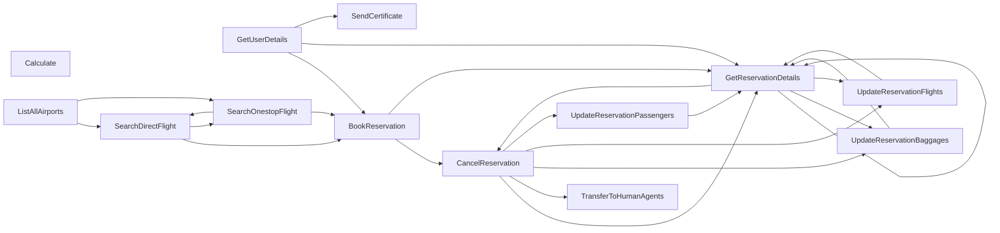

```mermaid
graph LR
    n0["BookReservation"]
    n1["Calculate"]
    n2["CancelReservation"]
    n3["GetReservationDetails"]
    n4["GetUserDetails"]
    n5["ListAllAirports"]
    n6["SearchDirectFlight"]
    n7["SearchOnestopFlight"]
    n8["SendCertificate"]
    n9["TransferToHumanAgents"]
    n10["UpdateReservationBaggages"]
    n11["UpdateReservationFlights"]
    n12["UpdateReservationPassengers"]
    n0 --> n2
    n0 --> n3
    n2 --> n3
    n2 --> n9
    n2 --> n10
    n2 --> n11
    n2 --> n12
    n3 --> n2
    n3 --> n3
    n3 --> n10
    n3 --> n11
    n4 --> n0
    n4 --> n3
    n4 --> n8
    n5 --> n6
    n5 --> n7
    n6 --> n0
    n6 --> n7
    n7 --> n0
    n7 --> n6
    n10 --> n3
    n11 --> n3
    n12 --> n3
```