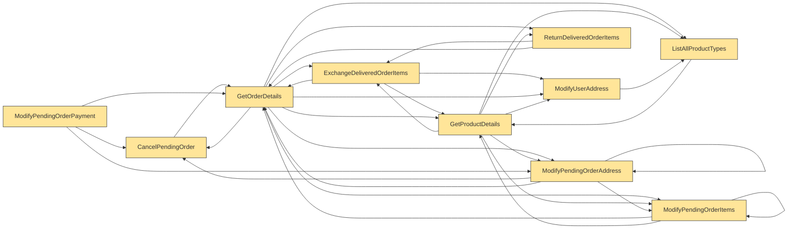

```mermaid
graph LR
  n0["CancelPendingOrder"]
  style n0 fill:#ffe599,stroke:#333,stroke-width:1px
  n1["ExchangeDeliveredOrderItems"]
  style n1 fill:#ffe599,stroke:#333,stroke-width:1px
  n2["GetOrderDetails"]
  style n2 fill:#ffe599,stroke:#333,stroke-width:1px
  n3["GetProductDetails"]
  style n3 fill:#ffe599,stroke:#333,stroke-width:1px
  n4["ListAllProductTypes"]
  style n4 fill:#ffe599,stroke:#333,stroke-width:1px
  n5["ModifyPendingOrderAddress"]
  style n5 fill:#ffe599,stroke:#333,stroke-width:1px
  n6["ModifyPendingOrderItems"]
  style n6 fill:#ffe599,stroke:#333,stroke-width:1px
  n7["ModifyPendingOrderPayment"]
  style n7 fill:#ffe599,stroke:#333,stroke-width:1px
  n8["ModifyUserAddress"]
  style n8 fill:#ffe599,stroke:#333,stroke-width:1px
  n9["ReturnDeliveredOrderItems"]
  style n9 fill:#ffe599,stroke:#333,stroke-width:1px
  n0 --> n2
  n1 --> n2
  n1 --> n3
  n1 --> n8
  n2 --> n0
  n2 --> n1
  n2 --> n3
  n2 --> n4
  n2 --> n5
  n2 --> n6
  n2 --> n8
  n2 --> n9
  n3 --> n1
  n3 --> n4
  n3 --> n5
  n3 --> n6
  n3 --> n8
  n3 --> n9
  n4 --> n3
  n5 --> n0
  n5 --> n2
  n5 --> n5
  n5 --> n6
  n6 --> n2
  n6 --> n3
  n6 --> n6
  n7 --> n0
  n7 --> n2
  n7 --> n5
  n8 --> n4
  n9 --> n1
  n9 --> n2
```