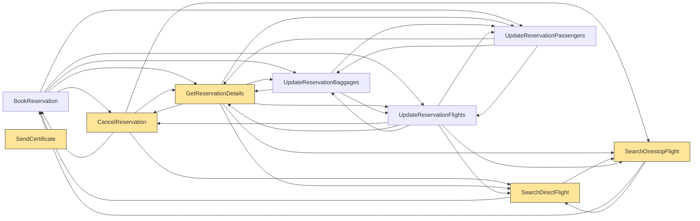

```mermaid
graph LR
  n0["BookReservation"]
  n1["CancelReservation"]
  style n1 fill:#ffe599,stroke:#333,stroke-width:1px
  n2["GetReservationDetails"]
  style n2 fill:#ffe599,stroke:#333,stroke-width:1px
  n3["SearchDirectFlight"]
  style n3 fill:#ffe599,stroke:#333,stroke-width:1px
  n4["SearchOnestopFlight"]
  style n4 fill:#ffe599,stroke:#333,stroke-width:1px
  n5["SendCertificate"]
  style n5 fill:#ffe599,stroke:#333,stroke-width:1px
  n6["UpdateReservationBaggages"]
  n7["UpdateReservationFlights"]
  n8["UpdateReservationPassengers"]
  n0 --> n1
  n0 --> n2
  n0 --> n6
  n0 --> n7
  n0 --> n8
  n1 --> n0
  n1 --> n2
  n1 --> n3
  n1 --> n4
  n2 --> n1
  n2 --> n3
  n2 --> n4
  n2 --> n6
  n2 --> n7
  n2 --> n8
  n3 --> n0
  n3 --> n4
  n4 --> n0
  n4 --> n3
  n6 --> n2
  n6 --> n7
  n6 --> n8
  n7 --> n1
  n7 --> n2
  n7 --> n3
  n7 --> n4
  n7 --> n6
  n7 --> n8
  n8 --> n2
  n8 --> n6
  n8 --> n7
```
