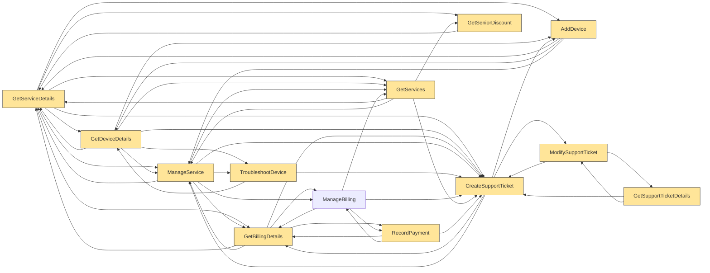

```mermaid
graph LR
  n0["GetServiceDetails"]
  style n0 fill:#ffe599,stroke:#333,stroke-width:1px
  n1["GetDeviceDetails"]
  style n1 fill:#ffe599,stroke:#333,stroke-width:1px
  n2["GetBillingDetails"]
  style n2 fill:#ffe599,stroke:#333,stroke-width:1px
  n3["ManageService"]
  style n3 fill:#ffe599,stroke:#333,stroke-width:1px
  n4["TroubleshootDevice"]
  style n4 fill:#ffe599,stroke:#333,stroke-width:1px
  n5["CreateSupportTicket"]
  style n5 fill:#ffe599,stroke:#333,stroke-width:1px
  n6["GetSupportTicketDetails"]
  style n6 fill:#ffe599,stroke:#333,stroke-width:1px
  n7["AddDevice"]
  style n7 fill:#ffe599,stroke:#333,stroke-width:1px
  n8["ManageBilling"]
  n9["GetServices"]
  style n9 fill:#ffe599,stroke:#333,stroke-width:1px
  n10["GetSeniorDiscount"]
  style n10 fill:#ffe599,stroke:#333,stroke-width:1px
  n11["ModifySupportTicket"]
  style n11 fill:#ffe599,stroke:#333,stroke-width:1px
  n12["RecordPayment"]
  style n12 fill:#ffe599,stroke:#333,stroke-width:1px
  n0 --> n1
  n0 --> n2
  n0 --> n3
  n0 --> n5
  n0 --> n7
  n0 --> n9
  n0 --> n10
  n1 --> n0
  n1 --> n3
  n1 --> n4
  n1 --> n5
  n1 --> n7
  n1 --> n9
  n2 --> n0
  n2 --> n3
  n2 --> n5
  n2 --> n8
  n2 --> n12
  n3 --> n0
  n3 --> n2
  n3 --> n4
  n3 --> n5
  n3 --> n8
  n3 --> n9
  n4 --> n1
  n4 --> n5
  n5 --> n2
  n5 --> n3
  n5 --> n7
  n5 --> n11
  n6 --> n5
  n6 --> n11
  n7 --> n0
  n7 --> n1
  n7 --> n3
  n8 --> n2
  n8 --> n5
  n8 --> n9
  n8 --> n12
  n9 --> n0
  n9 --> n3
  n9 --> n5
  n9 --> n10
  n10 --> n0
  n11 --> n5
  n11 --> n6
  n12 --> n2
  n12 --> n5
  n12 --> n8
```