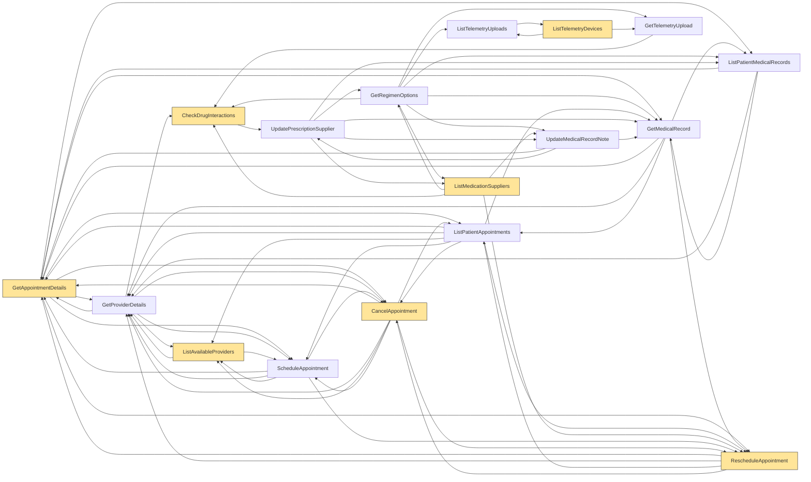

```mermaid
graph LR
  n0["GetAppointmentDetails"]
  style n0 fill:#ffe599,stroke:#333,stroke-width:1px
  n1["GetProviderDetails"]
  n2["GetMedicalRecord"]
  n3["GetRegimenOptions"]
  n4["ListPatientMedicalRecords"]
  n5["ListAvailableProviders"]
  style n5 fill:#ffe599,stroke:#333,stroke-width:1px
  n6["ListPatientAppointments"]
  n7["ListMedicationSuppliers"]
  style n7 fill:#ffe599,stroke:#333,stroke-width:1px
  n8["ListTelemetryUploads"]
  n9["CheckDrugInteractions"]
  style n9 fill:#ffe599,stroke:#333,stroke-width:1px
  n10["ScheduleAppointment"]
  n11["CancelAppointment"]
  style n11 fill:#ffe599,stroke:#333,stroke-width:1px
  n12["RescheduleAppointment"]
  style n12 fill:#ffe599,stroke:#333,stroke-width:1px
  n13["UpdatePrescriptionSupplier"]
  n14["ListTelemetryDevices"]
  style n14 fill:#ffe599,stroke:#333,stroke-width:1px
  n15["GetTelemetryUpload"]
  n16["UpdateMedicalRecordNote"]
  n0 --> n1
  n0 --> n2
  n0 --> n4
  n0 --> n6
  n0 --> n10
  n0 --> n11
  n0 --> n12
  n1 --> n0
  n1 --> n5
  n1 --> n9
  n1 --> n10
  n1 --> n11
  n2 --> n0
  n2 --> n1
  n2 --> n4
  n2 --> n6
  n2 --> n12
  n3 --> n2
  n3 --> n4
  n3 --> n7
  n3 --> n8
  n3 --> n9
  n3 --> n15
  n3 --> n16
  n4 --> n0
  n4 --> n1
  n4 --> n2
  n5 --> n1
  n5 --> n10
  n6 --> n0
  n6 --> n1
  n6 --> n2
  n6 --> n5
  n6 --> n10
  n6 --> n11
  n6 --> n12
  n7 --> n3
  n7 --> n9
  n7 --> n12
  n7 --> n16
  n8 --> n14
  n9 --> n13
  n10 --> n0
  n10 --> n1
  n10 --> n5
  n10 --> n11
  n10 --> n12
  n11 --> n0
  n11 --> n1
  n11 --> n5
  n11 --> n6
  n11 --> n10
  n11 --> n12
  n12 --> n0
  n12 --> n1
  n12 --> n6
  n12 --> n11
  n13 --> n2
  n13 --> n3
  n13 --> n4
  n13 --> n7
  n13 --> n16
  n14 --> n8
  n14 --> n15
  n15 --> n9
  n16 --> n0
  n16 --> n2
  n16 --> n13
```