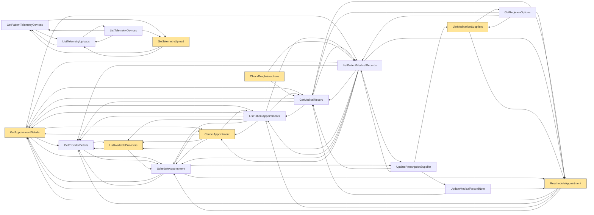

```mermaid
graph LR
  n0["GetAppointmentDetails"]
  style n0 fill:#ffe599,stroke:#333,stroke-width:1px
  n1["GetProviderDetails"]
  n2["GetMedicalRecord"]
  n3["GetPatientTelemetryDevices"]
  n4["GetRegimenOptions"]
  n5["ListPatientMedicalRecords"]
  n6["ListAvailableProviders"]
  style n6 fill:#ffe599,stroke:#333,stroke-width:1px
  n7["ListPatientAppointments"]
  n8["ListMedicationSuppliers"]
  style n8 fill:#ffe599,stroke:#333,stroke-width:1px
  n9["ListTelemetryUploads"]
  n10["CheckDrugInteractions"]
  style n10 fill:#ffe599,stroke:#333,stroke-width:1px
  n11["ScheduleAppointment"]
  n12["CancelAppointment"]
  style n12 fill:#ffe599,stroke:#333,stroke-width:1px
  n13["RescheduleAppointment"]
  style n13 fill:#ffe599,stroke:#333,stroke-width:1px
  n14["UpdatePrescriptionSupplier"]
  n15["ListTelemetryDevices"]
  n16["GetTelemetryUpload"]
  style n16 fill:#ffe599,stroke:#333,stroke-width:1px
  n17["UpdateMedicalRecordNote"]
  n0 --> n1
  n0 --> n2
  n0 --> n5
  n0 --> n7
  n0 --> n11
  n0 --> n12
  n1 --> n6
  n1 --> n11
  n2 --> n0
  n2 --> n1
  n2 --> n5
  n2 --> n7
  n2 --> n13
  n3 --> n9
  n3 --> n16
  n4 --> n2
  n4 --> n5
  n4 --> n8
  n4 --> n13
  n5 --> n0
  n5 --> n1
  n5 --> n2
  n5 --> n6
  n5 --> n7
  n5 --> n11
  n5 --> n12
  n5 --> n13
  n5 --> n14
  n6 --> n1
  n6 --> n11
  n7 --> n0
  n7 --> n1
  n7 --> n2
  n7 --> n5
  n7 --> n6
  n7 --> n11
  n7 --> n12
  n8 --> n4
  n8 --> n13
  n9 --> n3
  n9 --> n15
  n10 --> n2
  n10 --> n5
  n11 --> n0
  n11 --> n1
  n11 --> n12
  n11 --> n13
  n11 --> n14
  n12 --> n0
  n12 --> n6
  n12 --> n7
  n12 --> n11
  n13 --> n0
  n13 --> n1
  n13 --> n7
  n13 --> n11
  n14 --> n2
  n14 --> n5
  n14 --> n8
  n14 --> n17
  n15 --> n3
  n15 --> n9
  n15 --> n16
  n16 --> n3
  n16 --> n9
  n17 --> n0
  n17 --> n2
  n17 --> n13
```