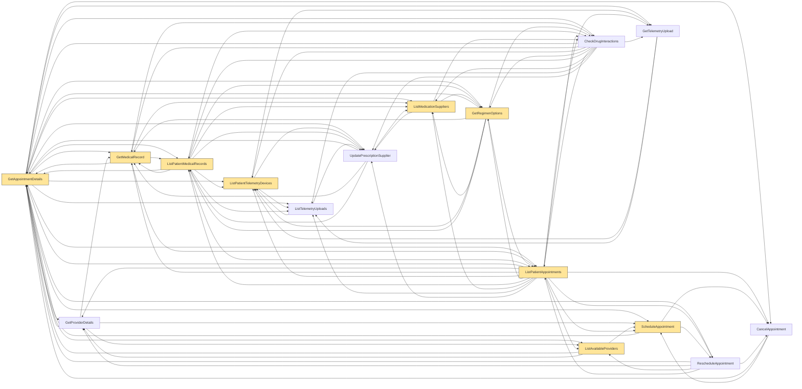

```mermaid
graph LR
  n0["GetAppointmentDetails"]
  style n0 fill:#ffe599,stroke:#333,stroke-width:1px
  n1["GetProviderDetails"]
  n2["GetMedicalRecord"]
  style n2 fill:#ffe599,stroke:#333,stroke-width:1px
  n3["ListPatientTelemetryDevices"]
  style n3 fill:#ffe599,stroke:#333,stroke-width:1px
  n4["GetRegimenOptions"]
  style n4 fill:#ffe599,stroke:#333,stroke-width:1px
  n5["ListPatientMedicalRecords"]
  style n5 fill:#ffe599,stroke:#333,stroke-width:1px
  n6["ListAvailableProviders"]
  style n6 fill:#ffe599,stroke:#333,stroke-width:1px
  n7["ListPatientAppointments"]
  style n7 fill:#ffe599,stroke:#333,stroke-width:1px
  n8["ListMedicationSuppliers"]
  style n8 fill:#ffe599,stroke:#333,stroke-width:1px
  n9["ListTelemetryUploads"]
  n10["CheckDrugInteractions"]
  n11["ScheduleAppointment"]
  style n11 fill:#ffe599,stroke:#333,stroke-width:1px
  n12["CancelAppointment"]
  n13["RescheduleAppointment"]
  n14["UpdatePrescriptionSupplier"]
  n15["GetTelemetryUpload"]
  n0 --> n1
  n0 --> n2
  n0 --> n3
  n0 --> n4
  n0 --> n5
  n0 --> n6
  n0 --> n7
  n0 --> n8
  n0 --> n9
  n0 --> n10
  n0 --> n11
  n0 --> n12
  n0 --> n13
  n0 --> n14
  n0 --> n15
  n1 --> n0
  n1 --> n2
  n1 --> n6
  n1 --> n11
  n2 --> n0
  n2 --> n5
  n2 --> n7
  n2 --> n8
  n2 --> n10
  n3 --> n9
  n3 --> n14
  n3 --> n15
  n4 --> n0
  n4 --> n2
  n4 --> n3
  n4 --> n5
  n4 --> n7
  n4 --> n8
  n4 --> n10
  n5 --> n0
  n5 --> n2
  n5 --> n3
  n5 --> n4
  n5 --> n7
  n5 --> n8
  n5 --> n9
  n5 --> n10
  n5 --> n14
  n6 --> n0
  n6 --> n1
  n6 --> n11
  n7 --> n0
  n7 --> n1
  n7 --> n2
  n7 --> n3
  n7 --> n4
  n7 --> n5
  n7 --> n6
  n7 --> n8
  n7 --> n9
  n7 --> n10
  n7 --> n11
  n7 --> n12
  n7 --> n13
  n7 --> n14
  n7 --> n15
  n8 --> n4
  n8 --> n10
  n8 --> n14
  n9 --> n3
  n9 --> n14
  n10 --> n0
  n10 --> n2
  n10 --> n3
  n10 --> n4
  n10 --> n5
  n10 --> n7
  n10 --> n8
  n10 --> n9
  n10 --> n14
  n10 --> n15
  n11 --> n0
  n11 --> n12
  n11 --> n13
  n12 --> n0
  n12 --> n11
  n13 --> n0
  n13 --> n1
  n13 --> n6
  n13 --> n7
  n13 --> n12
  n14 --> n0
  n14 --> n2
  n14 --> n5
  n14 --> n8
  n15 --> n3
  n15 --> n9
```