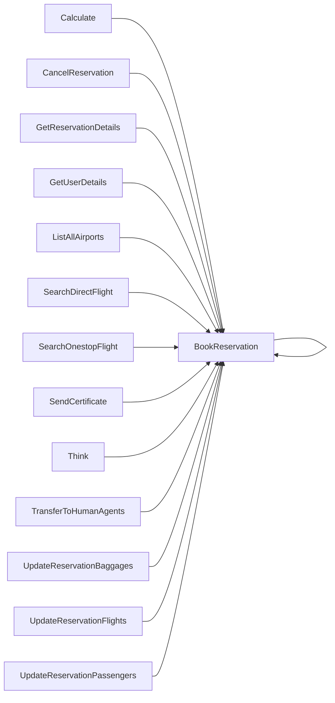

```mermaid
graph LR
    n0["BookReservation"]
    n1["Calculate"]
    n2["CancelReservation"]
    n3["GetReservationDetails"]
    n4["GetUserDetails"]
    n5["ListAllAirports"]
    n6["SearchDirectFlight"]
    n7["SearchOnestopFlight"]
    n8["SendCertificate"]
    n9["Think"]
    n10["TransferToHumanAgents"]
    n11["UpdateReservationBaggages"]
    n12["UpdateReservationFlights"]
    n13["UpdateReservationPassengers"]
    n0 --> n0
    n1 --> n0
    n2 --> n0
    n3 --> n0
    n4 --> n0
    n5 --> n0
    n6 --> n0
    n7 --> n0
    n8 --> n0
    n9 --> n0
    n10 --> n0
    n11 --> n0
    n12 --> n0
    n13 --> n0
```