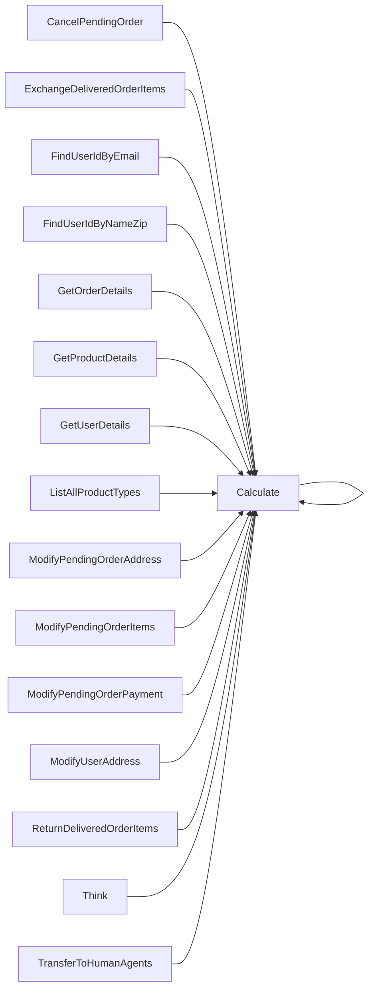

```mermaid
graph LR
    n0["Calculate"]
    n1["CancelPendingOrder"]
    n2["ExchangeDeliveredOrderItems"]
    n3["FindUserIdByEmail"]
    n4["FindUserIdByNameZip"]
    n5["GetOrderDetails"]
    n6["GetProductDetails"]
    n7["GetUserDetails"]
    n8["ListAllProductTypes"]
    n9["ModifyPendingOrderAddress"]
    n10["ModifyPendingOrderItems"]
    n11["ModifyPendingOrderPayment"]
    n12["ModifyUserAddress"]
    n13["ReturnDeliveredOrderItems"]
    n14["Think"]
    n15["TransferToHumanAgents"]
    n0 --> n0
    n1 --> n0
    n2 --> n0
    n3 --> n0
    n4 --> n0
    n5 --> n0
    n6 --> n0
    n7 --> n0
    n8 --> n0
    n9 --> n0
    n10 --> n0
    n11 --> n0
    n12 --> n0
    n13 --> n0
    n14 --> n0
    n15 --> n0
```