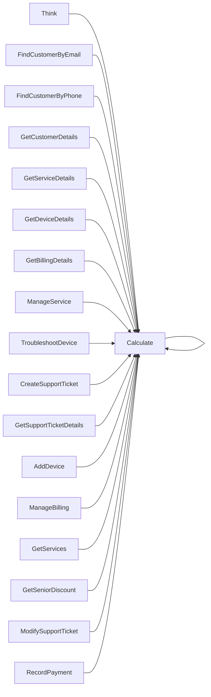

```mermaid
graph LR
    n0["Calculate"]
    n1["Think"]
    n2["FindCustomerByEmail"]
    n3["FindCustomerByPhone"]
    n4["GetCustomerDetails"]
    n5["GetServiceDetails"]
    n6["GetDeviceDetails"]
    n7["GetBillingDetails"]
    n8["ManageService"]
    n9["TroubleshootDevice"]
    n10["CreateSupportTicket"]
    n11["GetSupportTicketDetails"]
    n12["AddDevice"]
    n13["ManageBilling"]
    n14["GetServices"]
    n15["GetSeniorDiscount"]
    n16["ModifySupportTicket"]
    n17["RecordPayment"]
    n0 --> n0
    n1 --> n0
    n2 --> n0
    n3 --> n0
    n4 --> n0
    n5 --> n0
    n6 --> n0
    n7 --> n0
    n8 --> n0
    n9 --> n0
    n10 --> n0
    n11 --> n0
    n12 --> n0
    n13 --> n0
    n14 --> n0
    n15 --> n0
    n16 --> n0
    n17 --> n0
```