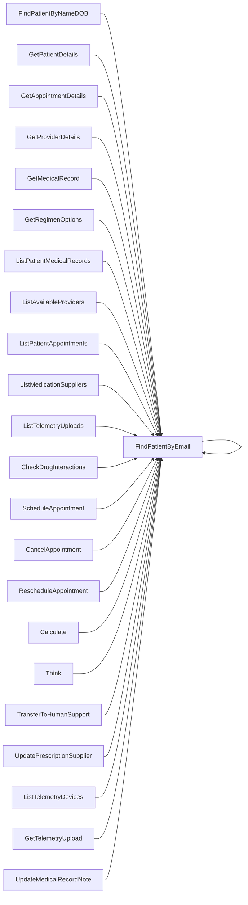

```mermaid
graph LR
    n0["FindPatientByEmail"]
    n1["FindPatientByNameDOB"]
    n2["GetPatientDetails"]
    n3["GetAppointmentDetails"]
    n4["GetProviderDetails"]
    n5["GetMedicalRecord"]
    n6["GetRegimenOptions"]
    n7["ListPatientMedicalRecords"]
    n8["ListAvailableProviders"]
    n9["ListPatientAppointments"]
    n10["ListMedicationSuppliers"]
    n11["ListTelemetryUploads"]
    n12["CheckDrugInteractions"]
    n13["ScheduleAppointment"]
    n14["CancelAppointment"]
    n15["RescheduleAppointment"]
    n16["Calculate"]
    n17["Think"]
    n18["TransferToHumanSupport"]
    n19["UpdatePrescriptionSupplier"]
    n20["ListTelemetryDevices"]
    n21["GetTelemetryUpload"]
    n22["UpdateMedicalRecordNote"]
    n0 --> n0
    n1 --> n0
    n2 --> n0
    n3 --> n0
    n4 --> n0
    n5 --> n0
    n6 --> n0
    n7 --> n0
    n8 --> n0
    n9 --> n0
    n10 --> n0
    n11 --> n0
    n12 --> n0
    n13 --> n0
    n14 --> n0
    n15 --> n0
    n16 --> n0
    n17 --> n0
    n18 --> n0
    n19 --> n0
    n20 --> n0
    n21 --> n0
    n22 --> n0
```