# FSP Visualizations for `airline_adjacency_matrix_0.1_fsps.json`


## FSP #0


### Variant: `base`

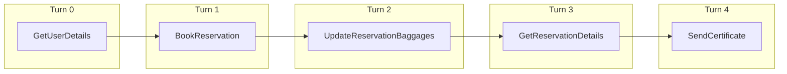


### Variant: `merged`

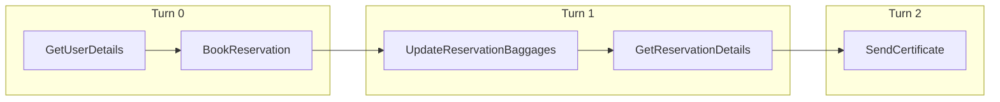


### Variant: `inserted`

```mermaid
graph LR
    %% FSP_0_inserted
    subgraph Turn_0 ["Turn 0"]
        direction LR
        t0_n0["GetUserDetails"]
        t0_n1["BookReservation"]
        t0_n0 --> t0_n1
        t0_n2["UpdateReservationPassengers"]
        t0_n1 --> t0_n2
    end
    subgraph Turn_1 ["Turn 1"]
        direction LR
        t1_n3["UpdateReservationBaggages"]
        t1_n4["GetReservationDetails"]
        t1_n3 --> t1_n4
        t1_n5["CancelReservation"]
        t1_n4 --> t1_n5
    end
    subgraph Turn_2 ["Turn 2"]
        direction LR
        t2_n6["SendCertificate"]
        t2_n7["UpdateReservationFlights"]
        t2_n6 --> t2_n7
    end
    t0_n2 --> t1_n3
    t1_n5 --> t2_n6
```


### Variant: `miss_params`

```mermaid
graph LR
    %% FSP_0_miss_params
    subgraph Turn_0 ["Turn 0"]
        direction LR
        t0_n0["GetUserDetails"]
        t0_n1["BookReservation"]
        t0_n0 --> t0_n1
        t0_n2["UpdateReservationPassengers"]
        t0_n1 --> t0_n2
    end
    subgraph Turn_1 ["Turn 1"]
        direction LR
        t1_n3["UpdateReservationBaggages"]
        t1_n4["GetReservationDetails"]
        t1_n3 --> t1_n4
        t1_n5["CancelReservation"]
        t1_n4 --> t1_n5
    end
    subgraph Turn_2 ["Turn 2"]
        direction LR
        t2_n6["MISSING(miss_params)"]
    end
    subgraph Turn_3 ["Turn 3"]
        direction LR
        t3_n7["SendCertificate"]
        t3_n8["UpdateReservationFlights"]
        t3_n7 --> t3_n8
    end
    t0_n2 --> t1_n3
    t1_n5 --> t2_n6
    t2_n6 --> t3_n7
```


### Variant: `miss_func`

```mermaid
graph LR
    %% FSP_0_miss_func
    subgraph Turn_0 ["Turn 0"]
        direction LR
        t0_n0["GetUserDetails"]
        t0_n1["BookReservation"]
        t0_n0 --> t0_n1
        t0_n2["UpdateReservationPassengers"]
        t0_n1 --> t0_n2
    end
    subgraph Turn_1 ["Turn 1"]
        direction LR
        t1_n3["MISSING(miss_func)"]
    end
    subgraph Turn_2 ["Turn 2"]
        direction LR
        t2_n4["UpdateReservationBaggages"]
        t2_n5["GetReservationDetails"]
        t2_n4 --> t2_n5
        t2_n6["CancelReservation"]
        t2_n5 --> t2_n6
    end
    subgraph Turn_3 ["Turn 3"]
        direction LR
        t3_n7["SendCertificate"]
        t3_n8["UpdateReservationFlights"]
        t3_n7 --> t3_n8
    end
    t0_n2 --> t1_n3
    t1_n3 --> t2_n4
    t2_n6 --> t3_n7
```


## FSP #1


### Variant: `base`

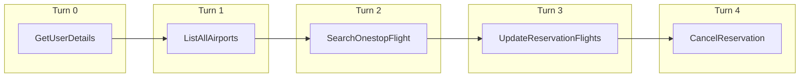


### Variant: `merged`


### Variant: `inserted`

```mermaid
graph LR
    %% FSP_1_inserted
    subgraph Turn_0 ["Turn 0"]
        direction LR
        t0_n0["GetUserDetails"]
        t0_n1["SendCertificate"]
        t0_n0 --> t0_n1
    end
    subgraph Turn_1 ["Turn 1"]
        direction LR
        t1_n2["ListAllAirports"]
        t1_n3["SearchOnestopFlight"]
        t1_n2 --> t1_n3
    end
    subgraph Turn_2 ["Turn 2"]
        direction LR
        t2_n4["SearchOnestopFlight"]
        t2_n5["BookReservation"]
        t2_n4 --> t2_n5
    end
    subgraph Turn_3 ["Turn 3"]
        direction LR
        t3_n6["UpdateReservationFlights"]
        t3_n7["GetReservationDetails"]
        t3_n6 --> t3_n7
    end
    subgraph Turn_4 ["Turn 4"]
        direction LR
        t4_n8["CancelReservation"]
    end
    t0_n1 --> t1_n2
    t1_n3 --> t2_n4
    t2_n5 --> t3_n6
    t3_n7 --> t4_n8
```


### Variant: `miss_params`

```mermaid
graph LR
    %% FSP_1_miss_params
    subgraph Turn_0 ["Turn 0"]
        direction LR
        t0_n0["GetUserDetails"]
        t0_n1["SendCertificate"]
        t0_n0 --> t0_n1
    end
    subgraph Turn_1 ["Turn 1"]
        direction LR
        t1_n2["ListAllAirports"]
        t1_n3["SearchOnestopFlight"]
        t1_n2 --> t1_n3
    end
    subgraph Turn_2 ["Turn 2"]
        direction LR
        t2_n4["SearchOnestopFlight"]
        t2_n5["BookReservation"]
        t2_n4 --> t2_n5
    end
    subgraph Turn_3 ["Turn 3"]
        direction LR
        t3_n6["UpdateReservationFlights"]
        t3_n7["GetReservationDetails"]
        t3_n6 --> t3_n7
    end
    subgraph Turn_4 ["Turn 4"]
        direction LR
        t4_n8["CancelReservation"]
    end
    subgraph Turn_5 ["Turn 5"]
        direction LR
        t5_n9["MISSING(miss_params)"]
    end
    t0_n1 --> t1_n2
    t1_n3 --> t2_n4
    t2_n5 --> t3_n6
    t3_n7 --> t4_n8
    t4_n8 --> t5_n9
```


### Variant: `miss_func`

```mermaid
graph LR
    %% FSP_1_miss_func
    subgraph Turn_0 ["Turn 0"]
        direction LR
        t0_n0["GetUserDetails"]
        t0_n1["SendCertificate"]
        t0_n0 --> t0_n1
    end
    subgraph Turn_1 ["Turn 1"]
        direction LR
        t1_n2["ListAllAirports"]
        t1_n3["SearchOnestopFlight"]
        t1_n2 --> t1_n3
    end
    subgraph Turn_2 ["Turn 2"]
        direction LR
        t2_n4["SearchOnestopFlight"]
        t2_n5["BookReservation"]
        t2_n4 --> t2_n5
    end
    subgraph Turn_3 ["Turn 3"]
        direction LR
        t3_n6["MISSING(miss_func)"]
    end
    subgraph Turn_4 ["Turn 4"]
        direction LR
        t4_n7["UpdateReservationFlights"]
        t4_n8["GetReservationDetails"]
        t4_n7 --> t4_n8
    end
    subgraph Turn_5 ["Turn 5"]
        direction LR
        t5_n9["CancelReservation"]
    end
    t0_n1 --> t1_n2
    t1_n3 --> t2_n4
    t2_n5 --> t3_n6
    t3_n6 --> t4_n7
    t4_n8 --> t5_n9
```


## FSP #2


### Variant: `base`

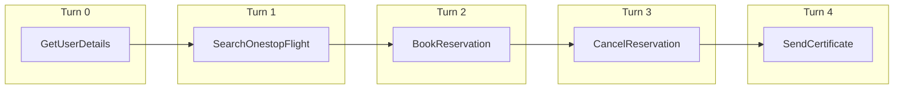


### Variant: `merged`

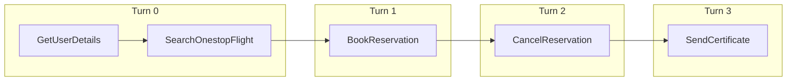


### Variant: `inserted`

```mermaid
graph LR
    %% FSP_2_inserted
    subgraph Turn_0 ["Turn 0"]
        direction LR
        t0_n0["GetUserDetails"]
        t0_n1["SearchOnestopFlight"]
        t0_n0 --> t0_n1
        t0_n2["BookReservation"]
        t0_n1 --> t0_n2
    end
    subgraph Turn_1 ["Turn 1"]
        direction LR
        t1_n3["BookReservation"]
        t1_n4["UpdateReservationFlights"]
        t1_n3 --> t1_n4
    end
    subgraph Turn_2 ["Turn 2"]
        direction LR
        t2_n5["CancelReservation"]
        t2_n6["GetReservationDetails"]
        t2_n5 --> t2_n6
    end
    subgraph Turn_3 ["Turn 3"]
        direction LR
        t3_n7["SendCertificate"]
    end
    t0_n2 --> t1_n3
    t1_n4 --> t2_n5
    t2_n6 --> t3_n7
```


### Variant: `miss_params`

```mermaid
graph LR
    %% FSP_2_miss_params
    subgraph Turn_0 ["Turn 0"]
        direction LR
        t0_n0["GetUserDetails"]
        t0_n1["SearchOnestopFlight"]
        t0_n0 --> t0_n1
        t0_n2["BookReservation"]
        t0_n1 --> t0_n2
    end
    subgraph Turn_1 ["Turn 1"]
        direction LR
        t1_n3["BookReservation"]
        t1_n4["UpdateReservationFlights"]
        t1_n3 --> t1_n4
    end
    subgraph Turn_2 ["Turn 2"]
        direction LR
        t2_n5["MISSING(miss_params)"]
    end
    subgraph Turn_3 ["Turn 3"]
        direction LR
        t3_n6["CancelReservation"]
        t3_n7["GetReservationDetails"]
        t3_n6 --> t3_n7
    end
    subgraph Turn_4 ["Turn 4"]
        direction LR
        t4_n8["SendCertificate"]
    end
    t0_n2 --> t1_n3
    t1_n4 --> t2_n5
    t2_n5 --> t3_n6
    t3_n7 --> t4_n8
```


### Variant: `miss_func`

```mermaid
graph LR
    %% FSP_2_miss_func
    subgraph Turn_0 ["Turn 0"]
        direction LR
        t0_n0["GetUserDetails"]
        t0_n1["SearchOnestopFlight"]
        t0_n0 --> t0_n1
        t0_n2["BookReservation"]
        t0_n1 --> t0_n2
    end
    subgraph Turn_1 ["Turn 1"]
        direction LR
        t1_n3["BookReservation"]
        t1_n4["UpdateReservationFlights"]
        t1_n3 --> t1_n4
    end
    subgraph Turn_2 ["Turn 2"]
        direction LR
        t2_n5["CancelReservation"]
        t2_n6["GetReservationDetails"]
        t2_n5 --> t2_n6
    end
    subgraph Turn_3 ["Turn 3"]
        direction LR
        t3_n7["SendCertificate"]
    end
    subgraph Turn_4 ["Turn 4"]
        direction LR
        t4_n8["MISSING(miss_func)"]
    end
    t0_n2 --> t1_n3
    t1_n4 --> t2_n5
    t2_n6 --> t3_n7
    t3_n7 --> t4_n8
```


## FSP #3


### Variant: `base`

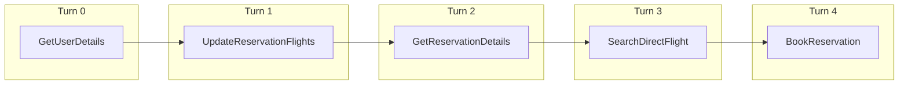


### Variant: `merged`


### Variant: `inserted`

```mermaid
graph LR
    %% FSP_3_inserted
    subgraph Turn_0 ["Turn 0"]
        direction LR
        t0_n0["GetUserDetails"]
        t0_n1["UpdateReservationPassengers"]
        t0_n0 --> t0_n1
    end
    subgraph Turn_1 ["Turn 1"]
        direction LR
        t1_n2["UpdateReservationFlights"]
        t1_n3["CancelReservation"]
        t1_n2 --> t1_n3
    end
    subgraph Turn_2 ["Turn 2"]
        direction LR
        t2_n4["GetReservationDetails"]
        t2_n5["SendCertificate"]
        t2_n4 --> t2_n5
    end
    subgraph Turn_3 ["Turn 3"]
        direction LR
        t3_n6["SearchDirectFlight"]
        t3_n7["SearchOnestopFlight"]
        t3_n6 --> t3_n7
    end
    subgraph Turn_4 ["Turn 4"]
        direction LR
        t4_n8["BookReservation"]
        t4_n9["UpdateReservationFlights"]
        t4_n8 --> t4_n9
    end
    t0_n1 --> t1_n2
    t1_n3 --> t2_n4
    t2_n5 --> t3_n6
    t3_n7 --> t4_n8
```


### Variant: `miss_params`

```mermaid
graph LR
    %% FSP_3_miss_params
    subgraph Turn_0 ["Turn 0"]
        direction LR
        t0_n0["GetUserDetails"]
        t0_n1["UpdateReservationPassengers"]
        t0_n0 --> t0_n1
    end
    subgraph Turn_1 ["Turn 1"]
        direction LR
        t1_n2["UpdateReservationFlights"]
        t1_n3["CancelReservation"]
        t1_n2 --> t1_n3
    end
    subgraph Turn_2 ["Turn 2"]
        direction LR
        t2_n4["GetReservationDetails"]
        t2_n5["SendCertificate"]
        t2_n4 --> t2_n5
    end
    subgraph Turn_3 ["Turn 3"]
        direction LR
        t3_n6["MISSING(miss_params)"]
    end
    subgraph Turn_4 ["Turn 4"]
        direction LR
        t4_n7["SearchDirectFlight"]
        t4_n8["SearchOnestopFlight"]
        t4_n7 --> t4_n8
    end
    subgraph Turn_5 ["Turn 5"]
        direction LR
        t5_n9["BookReservation"]
        t5_n10["UpdateReservationFlights"]
        t5_n9 --> t5_n10
    end
    t0_n1 --> t1_n2
    t1_n3 --> t2_n4
    t2_n5 --> t3_n6
    t3_n6 --> t4_n7
    t4_n8 --> t5_n9
```


### Variant: `miss_func`

```mermaid
graph LR
    %% FSP_3_miss_func
    subgraph Turn_0 ["Turn 0"]
        direction LR
        t0_n0["GetUserDetails"]
        t0_n1["UpdateReservationPassengers"]
        t0_n0 --> t0_n1
    end
    subgraph Turn_1 ["Turn 1"]
        direction LR
        t1_n2["UpdateReservationFlights"]
        t1_n3["CancelReservation"]
        t1_n2 --> t1_n3
    end
    subgraph Turn_2 ["Turn 2"]
        direction LR
        t2_n4["GetReservationDetails"]
        t2_n5["SendCertificate"]
        t2_n4 --> t2_n5
    end
    subgraph Turn_3 ["Turn 3"]
        direction LR
        t3_n6["SearchDirectFlight"]
        t3_n7["SearchOnestopFlight"]
        t3_n6 --> t3_n7
    end
    subgraph Turn_4 ["Turn 4"]
        direction LR
        t4_n8["MISSING(miss_func)"]
    end
    subgraph Turn_5 ["Turn 5"]
        direction LR
        t5_n9["BookReservation"]
        t5_n10["UpdateReservationFlights"]
        t5_n9 --> t5_n10
    end
    t0_n1 --> t1_n2
    t1_n3 --> t2_n4
    t2_n5 --> t3_n6
    t3_n7 --> t4_n8
    t4_n8 --> t5_n9
```


## FSP #4


### Variant: `base`

```mermaid
graph LR
    %% FSP_4_base
    subgraph Turn_0 ["Turn 0"]
        direction LR
        t0_n0["GetUserDetails"]
    end
    subgraph Turn_1 ["Turn 1"]
        direction LR
        t1_n1["UpdateReservationPassengers"]
    end
    subgraph Turn_2 ["Turn 2"]
        direction LR
        t2_n2["TransferToHumanAgents"]
    end
    t0_n0 --> t1_n1
    t1_n1 --> t2_n2
```


### Variant: `merged`

```mermaid
graph LR
    %% FSP_4_merged
    subgraph Turn_0 ["Turn 0"]
        direction LR
        t0_n0["GetUserDetails"]
    end
    subgraph Turn_1 ["Turn 1"]
        direction LR
        t1_n1["UpdateReservationPassengers"]
    end
    subgraph Turn_2 ["Turn 2"]
        direction LR
        t2_n2["TransferToHumanAgents"]
    end
    t0_n0 --> t1_n1
    t1_n1 --> t2_n2
```


### Variant: `inserted`

```mermaid
graph LR
    %% FSP_4_inserted
    subgraph Turn_0 ["Turn 0"]
        direction LR
        t0_n0["GetUserDetails"]
        t0_n1["BookReservation"]
        t0_n0 --> t0_n1
    end
    subgraph Turn_1 ["Turn 1"]
        direction LR
        t1_n2["UpdateReservationPassengers"]
        t1_n3["GetReservationDetails"]
        t1_n2 --> t1_n3
    end
    subgraph Turn_2 ["Turn 2"]
        direction LR
        t2_n4["TransferToHumanAgents"]
    end
    t0_n1 --> t1_n2
    t1_n3 --> t2_n4
```


### Variant: `miss_params`

```mermaid
graph LR
    %% FSP_4_miss_params
    subgraph Turn_0 ["Turn 0"]
        direction LR
        t0_n0["GetUserDetails"]
        t0_n1["BookReservation"]
        t0_n0 --> t0_n1
    end
    subgraph Turn_1 ["Turn 1"]
        direction LR
        t1_n2["MISSING(miss_params)"]
    end
    subgraph Turn_2 ["Turn 2"]
        direction LR
        t2_n3["UpdateReservationPassengers"]
        t2_n4["GetReservationDetails"]
        t2_n3 --> t2_n4
    end
    subgraph Turn_3 ["Turn 3"]
        direction LR
        t3_n5["TransferToHumanAgents"]
    end
    t0_n1 --> t1_n2
    t1_n2 --> t2_n3
    t2_n4 --> t3_n5
```


### Variant: `miss_func`

```mermaid
graph LR
    %% FSP_4_miss_func
    subgraph Turn_0 ["Turn 0"]
        direction LR
        t0_n0["GetUserDetails"]
        t0_n1["BookReservation"]
        t0_n0 --> t0_n1
    end
    subgraph Turn_1 ["Turn 1"]
        direction LR
        t1_n2["UpdateReservationPassengers"]
        t1_n3["GetReservationDetails"]
        t1_n2 --> t1_n3
    end
    subgraph Turn_2 ["Turn 2"]
        direction LR
        t2_n4["TransferToHumanAgents"]
    end
    subgraph Turn_3 ["Turn 3"]
        direction LR
        t3_n5["MISSING(miss_func)"]
    end
    t0_n1 --> t1_n2
    t1_n3 --> t2_n4
    t2_n4 --> t3_n5
```


## FSP #5


### Variant: `base`

```mermaid
graph LR
    %% FSP_5_base
    subgraph Turn_0 ["Turn 0"]
        direction LR
        t0_n0["GetUserDetails"]
    end
    subgraph Turn_1 ["Turn 1"]
        direction LR
        t1_n1["UpdateReservationPassengers"]
    end
    subgraph Turn_2 ["Turn 2"]
        direction LR
        t2_n2["UpdateReservationFlights"]
    end
    subgraph Turn_3 ["Turn 3"]
        direction LR
        t3_n3["GetReservationDetails"]
    end
    subgraph Turn_4 ["Turn 4"]
        direction LR
        t4_n4["UpdateReservationBaggages"]
    end
    t0_n0 --> t1_n1
    t1_n1 --> t2_n2
    t2_n2 --> t3_n3
    t3_n3 --> t4_n4
```


### Variant: `merged`

```mermaid
graph LR
    %% FSP_5_merged
    subgraph Turn_0 ["Turn 0"]
        direction LR
        t0_n0["GetUserDetails"]
    end
    subgraph Turn_1 ["Turn 1"]
        direction LR
        t1_n1["UpdateReservationPassengers"]
    end
    subgraph Turn_2 ["Turn 2"]
        direction LR
        t2_n2["UpdateReservationFlights"]
        t2_n3["GetReservationDetails"]
        t2_n2 --> t2_n3
    end
    subgraph Turn_3 ["Turn 3"]
        direction LR
        t3_n4["UpdateReservationBaggages"]
    end
    t0_n0 --> t1_n1
    t1_n1 --> t2_n2
    t2_n3 --> t3_n4
```


### Variant: `inserted`

```mermaid
graph LR
    %% FSP_5_inserted
    subgraph Turn_0 ["Turn 0"]
        direction LR
        t0_n0["GetUserDetails"]
        t0_n1["BookReservation"]
        t0_n0 --> t0_n1
    end
    subgraph Turn_1 ["Turn 1"]
        direction LR
        t1_n2["UpdateReservationPassengers"]
        t1_n3["UpdateReservationBaggages"]
        t1_n2 --> t1_n3
    end
    subgraph Turn_2 ["Turn 2"]
        direction LR
        t2_n4["UpdateReservationFlights"]
        t2_n5["GetReservationDetails"]
        t2_n4 --> t2_n5
        t2_n6["UpdateReservationBaggages"]
        t2_n5 --> t2_n6
    end
    subgraph Turn_3 ["Turn 3"]
        direction LR
        t3_n7["UpdateReservationBaggages"]
        t3_n8["UpdateReservationFlights"]
        t3_n7 --> t3_n8
    end
    t0_n1 --> t1_n2
    t1_n3 --> t2_n4
    t2_n6 --> t3_n7
```


### Variant: `miss_params`

```mermaid
graph LR
    %% FSP_5_miss_params
    subgraph Turn_0 ["Turn 0"]
        direction LR
        t0_n0["GetUserDetails"]
        t0_n1["BookReservation"]
        t0_n0 --> t0_n1
    end
    subgraph Turn_1 ["Turn 1"]
        direction LR
        t1_n2["UpdateReservationPassengers"]
        t1_n3["UpdateReservationBaggages"]
        t1_n2 --> t1_n3
    end
    subgraph Turn_2 ["Turn 2"]
        direction LR
        t2_n4["MISSING(miss_params)"]
    end
    subgraph Turn_3 ["Turn 3"]
        direction LR
        t3_n5["UpdateReservationFlights"]
        t3_n6["GetReservationDetails"]
        t3_n5 --> t3_n6
        t3_n7["UpdateReservationBaggages"]
        t3_n6 --> t3_n7
    end
    subgraph Turn_4 ["Turn 4"]
        direction LR
        t4_n8["UpdateReservationBaggages"]
        t4_n9["UpdateReservationFlights"]
        t4_n8 --> t4_n9
    end
    t0_n1 --> t1_n2
    t1_n3 --> t2_n4
    t2_n4 --> t3_n5
    t3_n7 --> t4_n8
```


### Variant: `miss_func`

```mermaid
graph LR
    %% FSP_5_miss_func
    subgraph Turn_0 ["Turn 0"]
        direction LR
        t0_n0["GetUserDetails"]
        t0_n1["BookReservation"]
        t0_n0 --> t0_n1
    end
    subgraph Turn_1 ["Turn 1"]
        direction LR
        t1_n2["UpdateReservationPassengers"]
        t1_n3["UpdateReservationBaggages"]
        t1_n2 --> t1_n3
    end
    subgraph Turn_2 ["Turn 2"]
        direction LR
        t2_n4["UpdateReservationFlights"]
        t2_n5["GetReservationDetails"]
        t2_n4 --> t2_n5
        t2_n6["UpdateReservationBaggages"]
        t2_n5 --> t2_n6
    end
    subgraph Turn_3 ["Turn 3"]
        direction LR
        t3_n7["UpdateReservationBaggages"]
        t3_n8["UpdateReservationFlights"]
        t3_n7 --> t3_n8
    end
    subgraph Turn_4 ["Turn 4"]
        direction LR
        t4_n9["MISSING(miss_func)"]
    end
    t0_n1 --> t1_n2
    t1_n3 --> t2_n4
    t2_n6 --> t3_n7
    t3_n8 --> t4_n9
```


## FSP #6


### Variant: `base`

```mermaid
graph LR
    %% FSP_6_base
    subgraph Turn_0 ["Turn 0"]
        direction LR
        t0_n0["GetUserDetails"]
    end
    subgraph Turn_1 ["Turn 1"]
        direction LR
        t1_n1["UpdateReservationPassengers"]
    end
    subgraph Turn_2 ["Turn 2"]
        direction LR
        t2_n2["UpdateReservationBaggages"]
    end
    subgraph Turn_3 ["Turn 3"]
        direction LR
        t3_n3["UpdateReservationFlights"]
    end
    subgraph Turn_4 ["Turn 4"]
        direction LR
        t4_n4["UpdateReservationBaggages"]
    end
    t0_n0 --> t1_n1
    t1_n1 --> t2_n2
    t2_n2 --> t3_n3
    t3_n3 --> t4_n4
```


### Variant: `merged`

```mermaid
graph LR
    %% FSP_6_merged
    subgraph Turn_0 ["Turn 0"]
        direction LR
        t0_n0["GetUserDetails"]
        t0_n1["UpdateReservationPassengers"]
        t0_n0 --> t0_n1
    end
    subgraph Turn_1 ["Turn 1"]
        direction LR
        t1_n2["UpdateReservationBaggages"]
        t1_n3["UpdateReservationFlights"]
        t1_n2 --> t1_n3
    end
    subgraph Turn_2 ["Turn 2"]
        direction LR
        t2_n4["UpdateReservationBaggages"]
    end
    t0_n1 --> t1_n2
    t1_n3 --> t2_n4
```


### Variant: `inserted`

```mermaid
graph LR
    %% FSP_6_inserted
    subgraph Turn_0 ["Turn 0"]
        direction LR
        t0_n0["GetUserDetails"]
        t0_n1["UpdateReservationPassengers"]
        t0_n0 --> t0_n1
        t0_n2["UpdateReservationBaggages"]
        t0_n1 --> t0_n2
    end
    subgraph Turn_1 ["Turn 1"]
        direction LR
        t1_n3["UpdateReservationBaggages"]
        t1_n4["UpdateReservationFlights"]
        t1_n3 --> t1_n4
        t1_n5["UpdateReservationPassengers"]
        t1_n4 --> t1_n5
    end
    subgraph Turn_2 ["Turn 2"]
        direction LR
        t2_n6["UpdateReservationBaggages"]
        t2_n7["UpdateReservationPassengers"]
        t2_n6 --> t2_n7
    end
    t0_n2 --> t1_n3
    t1_n5 --> t2_n6
```


### Variant: `miss_params`

```mermaid
graph LR
    %% FSP_6_miss_params
    subgraph Turn_0 ["Turn 0"]
        direction LR
        t0_n0["GetUserDetails"]
        t0_n1["UpdateReservationPassengers"]
        t0_n0 --> t0_n1
        t0_n2["UpdateReservationBaggages"]
        t0_n1 --> t0_n2
    end
    subgraph Turn_1 ["Turn 1"]
        direction LR
        t1_n3["UpdateReservationBaggages"]
        t1_n4["UpdateReservationFlights"]
        t1_n3 --> t1_n4
        t1_n5["UpdateReservationPassengers"]
        t1_n4 --> t1_n5
    end
    subgraph Turn_2 ["Turn 2"]
        direction LR
        t2_n6["MISSING(miss_params)"]
    end
    subgraph Turn_3 ["Turn 3"]
        direction LR
        t3_n7["UpdateReservationBaggages"]
        t3_n8["UpdateReservationPassengers"]
        t3_n7 --> t3_n8
    end
    t0_n2 --> t1_n3
    t1_n5 --> t2_n6
    t2_n6 --> t3_n7
```


### Variant: `miss_func`

```mermaid
graph LR
    %% FSP_6_miss_func
    subgraph Turn_0 ["Turn 0"]
        direction LR
        t0_n0["GetUserDetails"]
        t0_n1["UpdateReservationPassengers"]
        t0_n0 --> t0_n1
        t0_n2["UpdateReservationBaggages"]
        t0_n1 --> t0_n2
    end
    subgraph Turn_1 ["Turn 1"]
        direction LR
        t1_n3["UpdateReservationBaggages"]
        t1_n4["UpdateReservationFlights"]
        t1_n3 --> t1_n4
        t1_n5["UpdateReservationPassengers"]
        t1_n4 --> t1_n5
    end
    subgraph Turn_2 ["Turn 2"]
        direction LR
        t2_n6["UpdateReservationBaggages"]
        t2_n7["UpdateReservationPassengers"]
        t2_n6 --> t2_n7
    end
    subgraph Turn_3 ["Turn 3"]
        direction LR
        t3_n8["MISSING(miss_func)"]
    end
    t0_n2 --> t1_n3
    t1_n5 --> t2_n6
    t2_n7 --> t3_n8
```


## FSP #7


### Variant: `base`

```mermaid
graph LR
    %% FSP_7_base
    subgraph Turn_0 ["Turn 0"]
        direction LR
        t0_n0["GetUserDetails"]
    end
    subgraph Turn_1 ["Turn 1"]
        direction LR
        t1_n1["CancelReservation"]
    end
    subgraph Turn_2 ["Turn 2"]
        direction LR
        t2_n2["GetReservationDetails"]
    end
    subgraph Turn_3 ["Turn 3"]
        direction LR
        t3_n3["SearchDirectFlight"]
    end
    subgraph Turn_4 ["Turn 4"]
        direction LR
        t4_n4["SearchOnestopFlight"]
    end
    t0_n0 --> t1_n1
    t1_n1 --> t2_n2
    t2_n2 --> t3_n3
    t3_n3 --> t4_n4
```


### Variant: `merged`

```mermaid
graph LR
    %% FSP_7_merged
    subgraph Turn_0 ["Turn 0"]
        direction LR
        t0_n0["GetUserDetails"]
    end
    subgraph Turn_1 ["Turn 1"]
        direction LR
        t1_n1["CancelReservation"]
    end
    subgraph Turn_2 ["Turn 2"]
        direction LR
        t2_n2["GetReservationDetails"]
    end
    subgraph Turn_3 ["Turn 3"]
        direction LR
        t3_n3["SearchDirectFlight"]
        t3_n4["SearchOnestopFlight"]
        t3_n3 --> t3_n4
    end
    t0_n0 --> t1_n1
    t1_n1 --> t2_n2
    t2_n2 --> t3_n3
```


### Variant: `inserted`

```mermaid
graph LR
    %% FSP_7_inserted
    subgraph Turn_0 ["Turn 0"]
        direction LR
        t0_n0["GetUserDetails"]
        t0_n1["SendCertificate"]
        t0_n0 --> t0_n1
    end
    subgraph Turn_1 ["Turn 1"]
        direction LR
        t1_n2["CancelReservation"]
        t1_n3["GetReservationDetails"]
        t1_n2 --> t1_n3
    end
    subgraph Turn_2 ["Turn 2"]
        direction LR
        t2_n4["GetReservationDetails"]
        t2_n5["UpdateReservationBaggages"]
        t2_n4 --> t2_n5
    end
    subgraph Turn_3 ["Turn 3"]
        direction LR
        t3_n6["SearchDirectFlight"]
        t3_n7["SearchOnestopFlight"]
        t3_n6 --> t3_n7
        t3_n8["SearchDirectFlight"]
        t3_n7 --> t3_n8
    end
    t0_n1 --> t1_n2
    t1_n3 --> t2_n4
    t2_n5 --> t3_n6
```


### Variant: `miss_params`

```mermaid
graph LR
    %% FSP_7_miss_params
    subgraph Turn_0 ["Turn 0"]
        direction LR
        t0_n0["GetUserDetails"]
        t0_n1["SendCertificate"]
        t0_n0 --> t0_n1
    end
    subgraph Turn_1 ["Turn 1"]
        direction LR
        t1_n2["CancelReservation"]
        t1_n3["GetReservationDetails"]
        t1_n2 --> t1_n3
    end
    subgraph Turn_2 ["Turn 2"]
        direction LR
        t2_n4["GetReservationDetails"]
        t2_n5["UpdateReservationBaggages"]
        t2_n4 --> t2_n5
    end
    subgraph Turn_3 ["Turn 3"]
        direction LR
        t3_n6["MISSING(miss_params)"]
    end
    subgraph Turn_4 ["Turn 4"]
        direction LR
        t4_n7["SearchDirectFlight"]
        t4_n8["SearchOnestopFlight"]
        t4_n7 --> t4_n8
        t4_n9["SearchDirectFlight"]
        t4_n8 --> t4_n9
    end
    t0_n1 --> t1_n2
    t1_n3 --> t2_n4
    t2_n5 --> t3_n6
    t3_n6 --> t4_n7
```


### Variant: `miss_func`

```mermaid
graph LR
    %% FSP_7_miss_func
    subgraph Turn_0 ["Turn 0"]
        direction LR
        t0_n0["GetUserDetails"]
        t0_n1["SendCertificate"]
        t0_n0 --> t0_n1
    end
    subgraph Turn_1 ["Turn 1"]
        direction LR
        t1_n2["CancelReservation"]
        t1_n3["GetReservationDetails"]
        t1_n2 --> t1_n3
    end
    subgraph Turn_2 ["Turn 2"]
        direction LR
        t2_n4["GetReservationDetails"]
        t2_n5["UpdateReservationBaggages"]
        t2_n4 --> t2_n5
    end
    subgraph Turn_3 ["Turn 3"]
        direction LR
        t3_n6["MISSING(miss_func)"]
    end
    subgraph Turn_4 ["Turn 4"]
        direction LR
        t4_n7["SearchDirectFlight"]
        t4_n8["SearchOnestopFlight"]
        t4_n7 --> t4_n8
        t4_n9["SearchDirectFlight"]
        t4_n8 --> t4_n9
    end
    t0_n1 --> t1_n2
    t1_n3 --> t2_n4
    t2_n5 --> t3_n6
    t3_n6 --> t4_n7
```


## FSP #8


### Variant: `base`

```mermaid
graph LR
    %% FSP_8_base
    subgraph Turn_0 ["Turn 0"]
        direction LR
        t0_n0["GetUserDetails"]
    end
    subgraph Turn_1 ["Turn 1"]
        direction LR
        t1_n1["UpdateReservationPassengers"]
    end
    subgraph Turn_2 ["Turn 2"]
        direction LR
        t2_n2["TransferToHumanAgents"]
    end
    t0_n0 --> t1_n1
    t1_n1 --> t2_n2
```


### Variant: `merged`

```mermaid
graph LR
    %% FSP_8_merged
    subgraph Turn_0 ["Turn 0"]
        direction LR
        t0_n0["GetUserDetails"]
        t0_n1["UpdateReservationPassengers"]
        t0_n0 --> t0_n1
    end
    subgraph Turn_1 ["Turn 1"]
        direction LR
        t1_n2["TransferToHumanAgents"]
    end
    t0_n1 --> t1_n2
```


### Variant: `inserted`

```mermaid
graph LR
    %% FSP_8_inserted
    subgraph Turn_0 ["Turn 0"]
        direction LR
        t0_n0["GetUserDetails"]
        t0_n1["UpdateReservationPassengers"]
        t0_n0 --> t0_n1
        t0_n2["UpdateReservationFlights"]
        t0_n1 --> t0_n2
    end
    subgraph Turn_1 ["Turn 1"]
        direction LR
        t1_n3["TransferToHumanAgents"]
    end
    t0_n2 --> t1_n3
```


### Variant: `miss_params`

```mermaid
graph LR
    %% FSP_8_miss_params
    subgraph Turn_0 ["Turn 0"]
        direction LR
        t0_n0["GetUserDetails"]
        t0_n1["UpdateReservationPassengers"]
        t0_n0 --> t0_n1
        t0_n2["UpdateReservationFlights"]
        t0_n1 --> t0_n2
    end
    subgraph Turn_1 ["Turn 1"]
        direction LR
        t1_n3["TransferToHumanAgents"]
    end
    subgraph Turn_2 ["Turn 2"]
        direction LR
        t2_n4["MISSING(miss_params)"]
    end
    t0_n2 --> t1_n3
    t1_n3 --> t2_n4
```


### Variant: `miss_func`

```mermaid
graph LR
    %% FSP_8_miss_func
    subgraph Turn_0 ["Turn 0"]
        direction LR
        t0_n0["GetUserDetails"]
        t0_n1["UpdateReservationPassengers"]
        t0_n0 --> t0_n1
        t0_n2["UpdateReservationFlights"]
        t0_n1 --> t0_n2
    end
    subgraph Turn_1 ["Turn 1"]
        direction LR
        t1_n3["TransferToHumanAgents"]
    end
    subgraph Turn_2 ["Turn 2"]
        direction LR
        t2_n4["MISSING(miss_func)"]
    end
    t0_n2 --> t1_n3
    t1_n3 --> t2_n4
```


## FSP #9


### Variant: `base`

```mermaid
graph LR
    %% FSP_9_base
    subgraph Turn_0 ["Turn 0"]
        direction LR
        t0_n0["GetUserDetails"]
    end
    subgraph Turn_1 ["Turn 1"]
        direction LR
        t1_n1["UpdateReservationBaggages"]
    end
    subgraph Turn_2 ["Turn 2"]
        direction LR
        t2_n2["CancelReservation"]
    end
    subgraph Turn_3 ["Turn 3"]
        direction LR
        t3_n3["TransferToHumanAgents"]
    end
    t0_n0 --> t1_n1
    t1_n1 --> t2_n2
    t2_n2 --> t3_n3
```


### Variant: `merged`

```mermaid
graph LR
    %% FSP_9_merged
    subgraph Turn_0 ["Turn 0"]
        direction LR
        t0_n0["GetUserDetails"]
        t0_n1["UpdateReservationBaggages"]
        t0_n0 --> t0_n1
    end
    subgraph Turn_1 ["Turn 1"]
        direction LR
        t1_n2["CancelReservation"]
    end
    subgraph Turn_2 ["Turn 2"]
        direction LR
        t2_n3["TransferToHumanAgents"]
    end
    t0_n1 --> t1_n2
    t1_n2 --> t2_n3
```


### Variant: `inserted`

```mermaid
graph LR
    %% FSP_9_inserted
    subgraph Turn_0 ["Turn 0"]
        direction LR
        t0_n0["GetUserDetails"]
        t0_n1["UpdateReservationBaggages"]
        t0_n0 --> t0_n1
        t0_n2["GetReservationDetails"]
        t0_n1 --> t0_n2
    end
    subgraph Turn_1 ["Turn 1"]
        direction LR
        t1_n3["CancelReservation"]
        t1_n4["GetReservationDetails"]
        t1_n3 --> t1_n4
    end
    subgraph Turn_2 ["Turn 2"]
        direction LR
        t2_n5["TransferToHumanAgents"]
    end
    t0_n2 --> t1_n3
    t1_n4 --> t2_n5
```


### Variant: `miss_params`

```mermaid
graph LR
    %% FSP_9_miss_params
    subgraph Turn_0 ["Turn 0"]
        direction LR
        t0_n0["GetUserDetails"]
        t0_n1["UpdateReservationBaggages"]
        t0_n0 --> t0_n1
        t0_n2["GetReservationDetails"]
        t0_n1 --> t0_n2
    end
    subgraph Turn_1 ["Turn 1"]
        direction LR
        t1_n3["CancelReservation"]
        t1_n4["GetReservationDetails"]
        t1_n3 --> t1_n4
    end
    subgraph Turn_2 ["Turn 2"]
        direction LR
        t2_n5["MISSING(miss_params)"]
    end
    subgraph Turn_3 ["Turn 3"]
        direction LR
        t3_n6["TransferToHumanAgents"]
    end
    t0_n2 --> t1_n3
    t1_n4 --> t2_n5
    t2_n5 --> t3_n6
```


### Variant: `miss_func`

```mermaid
graph LR
    %% FSP_9_miss_func
    subgraph Turn_0 ["Turn 0"]
        direction LR
        t0_n0["GetUserDetails"]
        t0_n1["UpdateReservationBaggages"]
        t0_n0 --> t0_n1
        t0_n2["GetReservationDetails"]
        t0_n1 --> t0_n2
    end
    subgraph Turn_1 ["Turn 1"]
        direction LR
        t1_n3["CancelReservation"]
        t1_n4["GetReservationDetails"]
        t1_n3 --> t1_n4
    end
    subgraph Turn_2 ["Turn 2"]
        direction LR
        t2_n5["TransferToHumanAgents"]
    end
    subgraph Turn_3 ["Turn 3"]
        direction LR
        t3_n6["MISSING(miss_func)"]
    end
    t0_n2 --> t1_n3
    t1_n4 --> t2_n5
    t2_n5 --> t3_n6
```
